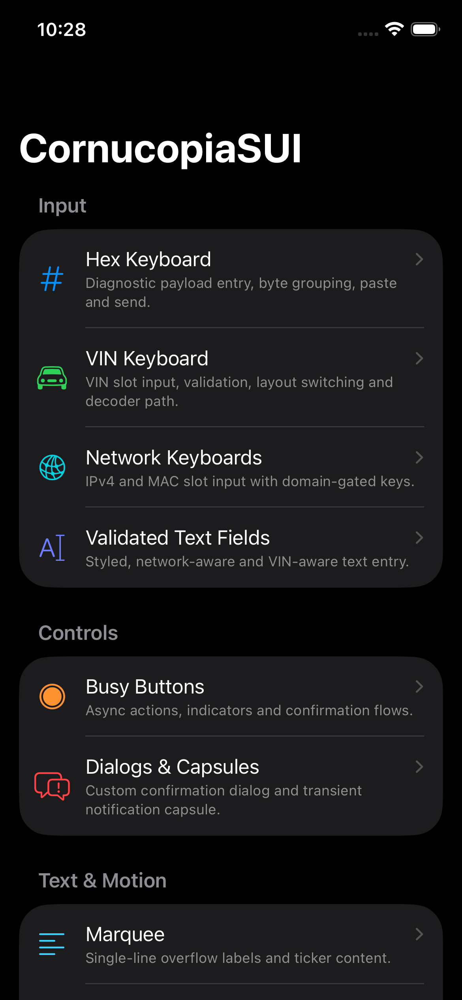
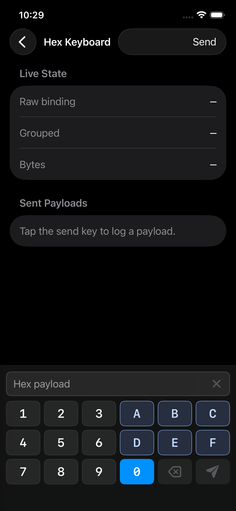
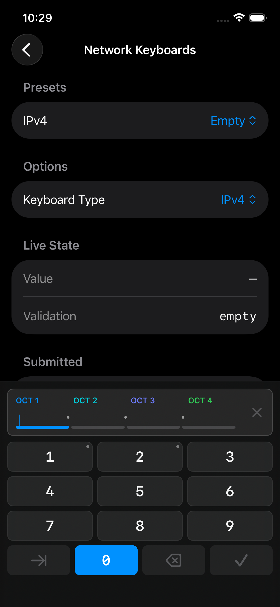
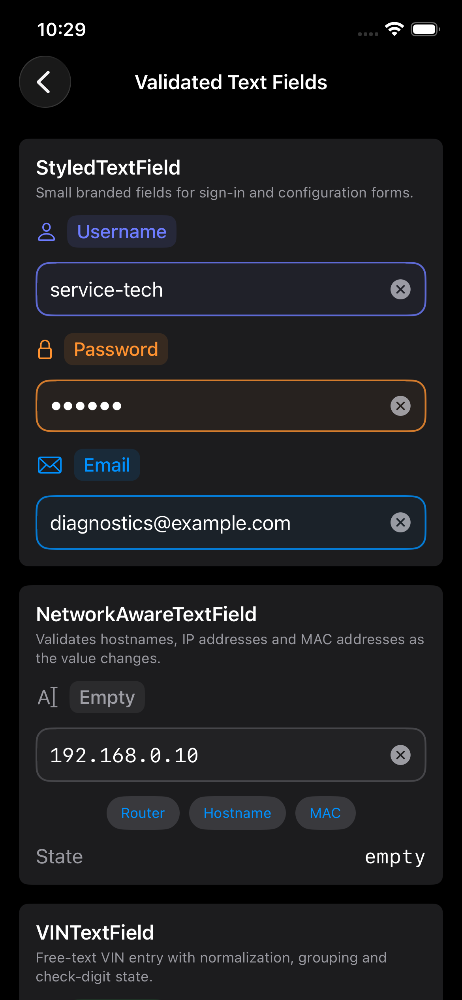

# CornucopiaSUI

CornucopiaSUI is an opinionated SwiftUI toolkit extracted from [my](https://www.vanille.de)
apps. It collects the controls, view modifiers and system wrappers that keep
coming up in technical, diagnostic and operations-heavy Apple apps: structured
inputs, reliable async feedback, small navigation helpers, transient status UI
and pragmatic bridges into UIKit and system services.

This is not a general-purpose design system. It is built for my own apps
first, and made reusable where the same problem repeats. That said, I'm happy to share it with others who might find it useful.

## Screenshots

| Demo catalog | Hex payload keypad |
| --- | --- |
|  |  |

| Network keypads | Validated text fields |
| --- | --- |
|  |  |

## Design Stance

CornucopiaSUI favors small, domain-aware components over broad generic
abstractions:

- Domain inputs should prevent invalid values before they enter the model.
- Bindings should stay normalized so callers do not need cleanup code.
- Long-running work should produce clear busy, confirmation and completion
  feedback.
- SwiftUI should remain the default, with UIKit/AppKit bridges only where the
  platform still requires them.
- Reusable controls should be exercised in a real app, not only in previews.

## Demo App

`Demo/` contains `CornucopiaSUIDemo`, an iOS catalog app for testing the package
under realistic Simulator conditions: touch feedback, hardware-keyboard input,
focus, sheets, overlays, permissions and system wrappers.

The demo is also intended to become a UI-test fixture. Catalog rows and focused
examples use stable accessibility identifiers such as `demo.row.<item>` and
`demo.<area>`.

For screenshots and focused UI-test launches, set `CORNUCOPIA_DEMO_SCREEN` to a
`DemoItem` raw value such as `hexKeyboard`, `networkKeyboards` or `textFields`.

```bash
cd Demo
xcodegen generate
set -o pipefail && xcodebuild -project CornucopiaSUIDemo.xcodeproj -scheme CornucopiaSUIDemo \
  -destination 'platform=iOS Simulator,name=iPhone 17 Pro Max' build | xcbeautify -qq
```

## Component Families

### Domain Inputs

These controls encode small technical protocols directly into the input flow.
They handle grouping, allowed characters, paste normalization, submit rules and
validity feedback.

- `HexKeyboardInput` for hex payloads and byte-oriented diagnostic messages.
- `VINKeyboardInput` for VIN entry with WMI/VDS/VIS grouping, check-digit
  emphasis and optional NHTSA vPIC decoding.
- `VINKeyboardTextField` for a regular styled field that uses
  `VINKeyboardInput` as its real iOS `inputView`.
- `IPv4KeyboardInput` for octet-by-octet IPv4 entry with 0-255 enforcement.
- `MACKeyboardInput` for MAC addresses with selectable separator styles.
- `NetworkAwareTextField` and `VINTextField` for free-text validation paths.
- `StyledTextField` for common iOS text-field presentation.

Do not combine a matching field and keyboard input for the same value. In
particular, do not use `VINTextField` with `VINKeyboardInput`, or
`NetworkAwareTextField` with `IPv4KeyboardInput`/`MACKeyboardInput`.
The `*KeyboardInput` controls are complete domain inputs, not accessories for
text fields. If a screen needs an OS-positioned VIN keyboard, use
`VINKeyboardTextField`; for other domains, use a normal field or implement a
real input method for that field instead of placing a keyboard view inside the
layout.

### Operational Feedback

Controls and overlays for actions that take time, need confirmation or should
leave a visible trace for the user.

- `BusyButton`, `GenericBusyButton` and `ConfirmationBusyButton`.
- `CC_busyButton` for turning existing view content into an async busy button.
- `CC_confirmationDialog` for custom iOS confirmation surfaces with standard
  and glass looks.
- `CC_slideOverCard` for SwiftUI-only iOS setup, pairing and permission cards
  with Apple-style bottom presentation, drag/tap dismissal, item-driven flows,
  padded or full-width layout, opaque-by-default surfaces and opt-in glass
  background bleeding.
- `CC_notificationCapsule`, `NotificationCapsuleController` and
  `NotificationCapsuleMessage` for Drops-inspired transient HUDs with queueing,
  actions, top/bottom placement, standard/glass backgrounds, accessibility
  announcements and status/warning/error/activity styles.
- `ObservableBusyness` for debounced busy state.

### Text, Motion and Status Displays

Small display helpers for compact dashboards and technical status surfaces.

- `MarqueeText` and `MarqueeScrollView` for one-line values that must not wrap.
- `BlendingTextLabel` for rotating short status labels.
- `SynchronizedBlendingTextLabel`, `SynchronizedBlendingContainer`,
  `BlendingSyncGroup` and `CC_blendingSyncGroup` for synchronized repeated
  status displays.

### Navigation, Lifecycle and Layout

Helpers for SwiftUI surfaces where the standard tools need a bit of glue.

- `NavigationController` for type-safe programmatic navigation.
- `CC_task` for persistent work that should survive view hierarchy changes.
- `CC_debouncedTask`, `CC_onFirstAppear`, `CC_blinking`, `CC_measureSize`,
  `CC_withInvisibleNavigation` and `CC_presentationDetentAutoHeight`.
- `SingleAxisGeometryReader`.

### System and UIKit Bridges

Focused wrappers for the platform paths Cornucopia apps use repeatedly.

- `ObservableReachability`.
- `ObservableLocalNetworkAuthorization`.
- `ImagePickerView` and `UIImage.CC_resized(height:)`.
- `DevicePickerView` and `AudioPlayer`.
- `KeyboardAwareness`.
- `UIApplication.CC_withIdleTimerDisabled`.

## Examples

### Hex Payload Entry

```swift
import CornucopiaSUI
import SwiftUI

struct PayloadEntry: View {
    @State private var payload = ""

    var body: some View {
        HexKeyboardInput($payload, placeholder: "UDS payload") {
            send(payload)
        }
    }

    private func send(_ payload: String) {
        // payload is already normalized by the control
    }
}
```

### Slide-over Setup Card

```swift
import CornucopiaSUI
import SwiftUI

struct PairingPrompt: View {
    @State private var isPairingVisible = false

    var body: some View {
        Button("Pair Adapter") {
            isPairingVisible = true
        }
        .CC_slideOverCard(
            isPresented: $isPairingVisible,
            style: CC_SlideOverCardStyle(surfaceStyle: .standard, accentTint: .green)
        ) {
            VStack(spacing: 16) {
                Text("OBD Adapter Found")
                    .font(.title3.bold())

                Text("Keep the ignition on while the connection is prepared.")
                    .foregroundStyle(.secondary)
                    .multilineTextAlignment(.center)

                Button {
                    isPairingVisible = false
                } label: {
                    Label("Pair Adapter", systemImage: "link")
                }
                .buttonStyle(CC_SlideOverCardActionButtonStyle(.primary, tint: .green))
            }
            .frame(maxWidth: .infinity)
        }
    }
}
```

Use `CC_slideOverCard(item:style:options:onDismiss:content:)` for multi-step
setup flows. Content-height changes animate automatically, including cards that
contain focused text fields. The default setup surface is intentionally opaque;
enable `allowsBackgroundBleeding` only for app-specific glass previews.

### Confirmed Async Action

```swift
import CornucopiaSUI
import SwiftUI

struct ClearCacheButton: View {
    @State private var isBusy = false

    var body: some View {
        ConfirmationBusyButton(
            "Erase Cache",
            isBusy: $isBusy,
            confirmationTitle: "Erase cached data?",
            confirmationMessage: "This cannot be undone.",
            confirmButtonTitle: "Erase",
            confirmButtonRole: .destructive
        ) {
            await clearCache()
        }
        .buttonStyle(.borderedProminent)
        .tint(.red)
    }

    private func clearCache() async {
        // perform long-running work
    }
}
```

### Programmatic Navigation

```swift
import CornucopiaSUI
import SwiftUI

enum Destination: Hashable {
    case detail(String)
}

struct AppRoot: View {
    @StateObject private var navigation = NavigationController()

    var body: some View {
        NavigationStack(path: $navigation.path) {
            Button("Open Detail") {
                navigation.push(Destination.detail("demo"))
            }
            .navigationDestination(for: Destination.self) { destination in
                switch destination {
                    case .detail(let id):
                        Text(id)
                }
            }
        }
        .environment(\.CC_navigationController, navigation)
    }
}
```

## Installation

Add CornucopiaSUI as a Swift Package dependency:

```swift
dependencies: [
    .package(url: "https://github.com/Cornucopia-Swift/CornucopiaSUI", branch: "master")
]
```

Then add the `CornucopiaSUI` product to your target.

## Platform Support

- iOS 17+
- macOS 13+
- tvOS 17+
- watchOS 10+

Some components are platform-specific. UIKit-backed helpers are guarded with
availability checks and compile-time platform conditions.

## Build and Test

```bash
swift build
swift test
```

For the iOS demo app:

```bash
cd Demo
xcodegen generate
xcodebuild -project CornucopiaSUIDemo.xcodeproj -scheme CornucopiaSUIDemo \
  -destination 'platform=iOS Simulator,name=iPhone 17 Pro Max' build
```

## Dependencies

- [CornucopiaCore](https://github.com/Cornucopia-Swift/CornucopiaCore) for
  shared foundation types such as `Logger`, `Protected` and `BusynessObserver`.
- [SFSafeSymbols](https://github.com/SFSafeSymbols/SFSafeSymbols) for typed SF
  Symbol access.
- [Automotive-Swift/VIN](https://github.com/Automotive-Swift/VIN) for VIN
  syntax, WMI/region/manufacturer and model-year parsing.

## License

Available under the MIT License.
